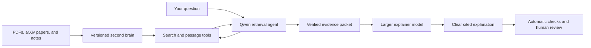

# How the AI research assistant works

September 13 update: the initial folder-based Obsidian integration now imports Markdown and
text-based PDFs and exports cited explanation notes. Try the [local demo](OBSIDIAN_WORKFLOW.md).
The larger-library indexing and live model evaluation work described below are still pending.

## The idea in one sentence

This project is building a personal second brain for AI papers: a small Qwen agent searches your
paper library and gathers exact evidence, then a larger model turns that evidence into an
understandable explanation.

The goal is not to make Qwen memorize thousands of papers. Papers change, new work appears, and
private documents should remain under your control. The goal is to teach Qwen a reusable research
process:

1. Decide what evidence it needs.
2. Search the available papers.
3. Read the most relevant passages.
4. Attach each factual claim to an exact source span.
5. Admit when the available material does not support an answer.

## The complete system



Each component has a separate job.

### 1. The second brain stores the source material

The second brain is a versioned collection of papers and notes. Each document has:

- a stable document ID;
- title, authors, date, and source URL;
- extracted text;
- section and character offsets;
- an extraction-coverage warning;
- a checksum that detects later changes.

The current prototype contains six pinned arXiv papers about retrieval and tool-using agents. It
uses deterministic lexical passage search. This is enough to test the research loop, but it is not
yet the planned large personal library.

A larger version will need local PDF ingestion, page-level references, duplicate detection, and a
persistent hybrid search index that combines lexical and embedding retrieval. It should update the
live library without changing old benchmark snapshots.

### 2. Qwen is the retrieval agent

Qwen receives the question, the available tool descriptions, and the result of each previous tool
request. It decides what action to take next.

Qwen does not execute code. It emits one constrained JSON request:

```json
{
  "action": "search_papers",
  "arguments": {
    "query": "retrieved token loss masking",
    "top_k": 3
  }
}
```

The application validates the request and executes it. Only four read-only actions are available:

- `papers`: list papers in the current snapshot;
- `search_papers`: find relevant passage windows;
- `paper`: inspect one paper's metadata and section offsets;
- `passage`: read a bounded exact span of one paper.

Unknown actions, additional arguments, shell commands, file access, and arbitrary Python are
rejected. This matches the production agent pattern: the model requests an operation, while the
application controls whether and how it runs.

### 3. Qwen submits candidate findings

After searching and reading, Qwen submits candidate claims with document IDs and offsets:

```json
{
  "action": "submit",
  "answer": {
    "claims": [
      {
        "text": "Search-R1 masks retrieved tokens out of its policy-gradient loss.",
        "evidence": [
          {
            "doc_id": "arxiv_2503_09516v5",
            "start": 13380,
            "end": 14113
          }
        ]
      }
    ],
    "recommendation": "Inference: retain action-token-only loss in our training baseline.",
    "limitations": [
      "This result does not establish improved research synthesis for our agent."
    ]
  }
}
```

Qwen does not have to retype the passage. The runner checks the document and offsets against the
frozen snapshot and inserts the exact source text. That prevents a common failure in which a model
slightly changes a quotation while presenting it as verbatim evidence.

This check establishes provenance: the text really occurs at that location. It does not establish
entailment: the passage may still be irrelevant or may not justify Qwen's claim.

### 4. The evidence packet separates retrieval from explanation

The application converts a valid Qwen submission into a bounded evidence packet. Each verified
passage receives a local ID such as `E1` or `E2`. The packet includes:

- the original question;
- Qwen's candidate claims, explicitly marked as untrusted;
- the exact selected passages and their source locations;
- Qwen's proposed recommendation and limitations;
- the corpus and retriever-run identities.

Invalid source spans are not forwarded. A hosted larger model receives only this packet rather
than the complete private paper library. For sensitive material that cannot leave the machine, the
larger explainer can also be a locally hosted model.

### 5. A larger model explains the evidence

The larger agent independently judges Qwen's candidate interpretation and writes a clear answer.
It may cite only evidence IDs present in the packet:

```json
{
  "answer": "Search-R1 excludes retrieved text from the optimization target because those tokens were not generated by the policy [E1]. For this project, that supports masking retrieved observations during training, but it does not prove the resulting model will produce better paper summaries.",
  "claims": [
    {
      "text": "Search-R1 excludes retrieved text from its policy-gradient target.",
      "evidence_ids": ["E1"]
    }
  ],
  "limitations": [
    "The supplied experiment evaluates Search-R1, not this research assistant."
  ]
}
```

The runner rejects invented evidence IDs and saves the explainer's complete input, output, model
configuration, and checks. This makes the result reproducible and reviewable.

The larger model is not automatically trustworthy. It can still misunderstand a real passage or
add unsupported prose. Claim support and usefulness remain evaluation targets.

## A full example

Suppose you ask:

> Should my RAG application use a special mechanism when retrieval returns no useful evidence?

The interaction would look like this:

1. Qwen searches for `null document retrieval no useful evidence`.
2. Search returns a passage from the original RAG paper.
3. Qwen reads the exact passage and perhaps searches for an alternative such as corrective
   retrieval.
4. Qwen submits both passages, candidate claims, and the uncertainty it found.
5. The runner reconstructs the exact source text and creates evidence IDs.
6. The larger model explains that the original RAG authors tested several null-document variants
   without an improvement, while another paper proposes a different correction strategy.
7. The final answer labels any recommendation for your application as an inference.
8. The evaluation records whether both claims were supported, whether important evidence was
   missed, and whether the answer was useful.

The live prototype exposed why this separation matters. Base Qwen found a real passage about the
null-document experiment, but its recommendation suggested implementing the mechanism even after
reporting that the paper found no improvement. A valid citation alone did not make the synthesis
good.

## What QLoRA training changes

QLoRA training does not load paper knowledge permanently into Qwen. It trains a small adapter that
changes how Qwen behaves in the research loop.

A reviewed training trajectory contains:

```text
Input: question and available research actions
Target: useful search request

Input: question plus returned search results
Target: appropriate passage request or refined search

Input: question plus passages read so far
Target: supported submission or justified abstention
```

Training loss is applied to Qwen's actions and submissions. Tool observations and quoted paper
text are inputs, not targets to memorize. We plan to train the adapter with Unsloth QLoRA on a
RunPod GPU. The output will be a relatively small adapter used together with Qwen3-8B.

The training data and evaluation papers must be disjoint. Otherwise, improved test performance
could come from memorizing the papers or expected answers rather than learning a transferable
research process.

## How we determine whether training worked

We run the same questions with the same paper snapshot, tool definitions, step budget, decoding
settings, and seed for:

1. Base Qwen3-8B.
2. Qwen3-8B with the research QLoRA adapter.

Automatic metrics measure:

- successful submission rate;
- valid source-span rate;
- retrieval of expected documents;
- rejected or failed tool actions;
- number of research steps.

Human review measures:

- whether each passage supports its claim;
- unsupported-claim rate;
- correct handling of insufficient evidence;
- missed relevant evidence;
- whether recommendations remain faithful to the papers;
- usefulness for an actual project decision.

The eight-question pilot validates this evaluation machinery. It is too small for the final
headline. The planned final test uses 50–75 questions over reserved papers that never appear in
training.

The intended result is:

> Fine-tuning taught a small open model to gather more relevant paper evidence, make fewer
> unsupported claims, and abstain more appropriately on unseen papers.

The result is not established until the before-and-after benchmark supports it.

## What exists today

Implemented and tested:

- versioned arXiv ingestion and frozen corpus checks;
- selected Obsidian folder ingestion for Markdown and text-based PDFs, plus cited note export;
- deterministic paper and passage search;
- multi-turn validated JSON actions for Qwen;
- exact source-span materialization;
- an eight-question benchmark pilot and human-review schema;
- a bounded evidence packet for a larger explainer;
- validation that prevents the explainer from inventing evidence references;
- JSON and Markdown run artifacts with reproducibility metadata.

Still to build or run:

- a successful live Qwen test of the new structured-action protocol;
- the complete base-Qwen pilot and human review;
- scalable indexing and richer extraction for a large PDF library;
- a larger final held-out benchmark;
- reviewed teacher trajectories from separate training papers;
- the Unsloth QLoRA training script and first adapter;
- the paired base-versus-trained evaluation;
- a simple interactive interface for everyday use.

There are currently no 20 golden Claude trajectories, no trained research adapter, and no evidence
that training has improved Qwen yet.

## How it could feel as a finished product

You add papers to a local folder or save them from arXiv. The second brain indexes new versions and
shows any parsing problems. You ask a practical question in a small application. Qwen researches
the library locally, and you can watch or hide its search trail. A stronger model then explains the
selected evidence at your preferred level—beginner, engineer, or research detail. Every important
claim opens the exact passage and original paper. When the library cannot support an answer, the
assistant says what is missing and proposes a bounded search rather than inventing certainty.

That is the useful product and the research experiment: a private paper assistant whose research
behavior can be inspected, trained, and measured.
