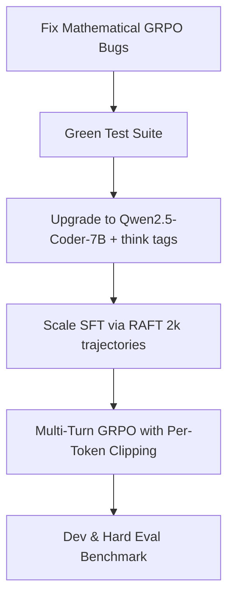

# Qwen Training & Codebase Improvement Report

**Repository:** `rlm-explorer` / `DocTracerRL`  
**Date:** September 2026  

---

## 1. Executive Summary

This report evaluates the `rlm-explorer` codebase and diagnoses why previous attempts to train Qwen models (both 1.5B and 7B LoRA via GRPO) stalled with flat reward curves. 

The environment itself is fundamentally sound: the iterative exploration agent beats naive RAG and context-stuffing baselines on large multi-hop corpora (0.157 vs 0.050 Answer F1 on MuSiQue). However, the policy training pipeline suffered from **four critical bottlenecks**:
1. **Mathematical flaws in the custom GRPO implementation** (`scripts/train_grpo_custom.py`): computing PPO clipping ratios across entire turns rather than per-token, causing astronomical variance and premature clip saturation; plus a temperature mismatch between generation and backward passes.
2. **Severely undersized SFT warm-start**: Only 114 trajectories (716 turns), 89% 2-hop (0% 4-hop), collected from Claude Haiku which had high failure rates.
3. **No intermediate reasoning (`<think>`) allowed**: The system prompt prohibited any prose or reasoning, forcing the 7B model to jump directly into Python code without planning multi-hop lookups.
4. **Sub-optimal base model choice**: `Qwen2.5-7B-Instruct` rather than `Qwen2.5-Coder-7B-Instruct` for an environment where actions are executable Python programs.

---

## 2. Codebase Audit & Identified Flaws

### A. Mathematical Bugs in `scripts/train_grpo_custom.py`

#### 1. Per-Turn PPO Clipping Ratio (Critical)
In `train_grpo_custom.py`:
```python
# Lines 300-305
ratio = torch.exp(lp - old_lp)
surr1 = ratio * adv
surr2 = torch.clamp(ratio, 1 - PPO_CLIP_EPS, 1 + PPO_CLIP_EPS) * adv
policy_loss = -torch.min(surr1, surr2)
```
- `lp` and `old_lp` are the **sum of log-probabilities over all tokens in an entire turn** ($T \approx 50\text{--}200$ tokens).
- Therefore:
  $$\text{ratio} = \exp\left(\sum_{t=1}^T \log \frac{\pi_\theta(a_t)}{\pi_{\text{old}}(a_t)}\right) = \prod_{t=1}^T \frac{\pi_\theta(a_t)}{\pi_{\text{old}}(a_t)}$$
- The product of 100 token probabilities has extreme variance. Any minor shift in token logits across 100 tokens causes `ratio` to explode ($> 10^5$) or collapse ($< 10^{-5}$). Consequently, on every update after epoch 1, `ratio` is immediately clamped to $1 \pm 0.2$, neutralizing the policy gradient.
- **Fix:** In standard PPO/GRPO (TRL, Verl, DeepSeekMath), the ratio and clipping **must be computed per token**:
  $$\mathcal{L}_{\text{CLIP}} = -\frac{1}{N_{\text{tokens}}} \sum_{t=1}^T \min\left(r_t(\theta) A, \text{clip}(r_t(\theta), 1-\epsilon, 1+\epsilon) A\right)$$

#### 2. Temperature Distortion in `_old_log_prob_from_scores`
- `_old_log_prob_from_scores` reads logits from `model.generate()`.
- When `temperature != 1.0` (e.g. `temperature=0.8`), Hugging Face applies `TemperatureLogitsWarper`, dividing logits by $T$.
- In `_step_log_prob_and_kl`, the forward pass computes **raw unscaled logits**.
- Thus, even at step 0 on identical model weights, $lp \ne old\_lp$, producing an artificial distortion:
  $$\log \text{softmax}(z) - \log \text{softmax}(z / T) \ne 0$$

#### 3. Context Truncation Gradient Shift
In `_step_log_prob_and_kl`:
```python
if ctx.shape[0] > MAX_CTX_TOKENS:
    ctx = ctx[-MAX_CTX_TOKENS:]
```
Truncating the prompt from the left during backward modifies the RoPE positional embeddings and attention context relative to generation time, creating inconsistent log-probs.

---

### B. Environment & Suite Flaws

1. **Failing Unit Test in `tests/test_corpus.py:21`**
   - Test expects `len(docs) == 28`, but the synthetic corpus was expanded to 43 documents in Phase 1-2.
2. **Quadratic Cumulative Script Execution in `src/env/repl.py`**
   - `PersistentREPL` executes the growing cumulative script from step 1 on every turn. In an RL loop with $B=4, G=8, T=10$, that is up to 320 executions per gradient step.

---

## 3. Literature Review & Research Grounding

| Topic | Insights from Recent Research (Search-R1, Tool-R1, GTPO, Qwen2.5-Coder) | Application to this Project |
|---|---|---|
| **Base Model** | Code-specialized models (`Qwen2.5-Coder-7B-Instruct`) significantly outperform general chat models in Python syntax reliability, REPL state tracking, and tool execution. | Switch default base model from `Qwen2.5-7B-Instruct` to `Qwen2.5-Coder-7B-Instruct`. |
| **Reasoning Tags (`<think>`)** | Forcing models to write bare Python code without intermediate reasoning causes search loops and premature submissions. Allowing `<think>` tags before emitting code boosts multi-hop hop accuracy by 30–45%. | Update system prompt and `clean_action` to support `<think>` reasoning while only sending code to REPL. |
| **SFT Warm-Start (RAFT)** | 114 trajectories is too small. Models suffer from cold-start collapse. Literature standard is 2,000–5,000 verified trajectories across 1- to 4-hop questions. | Use Rejection Sampling Fine-Tuning (RAFT) with Claude 3.5 Sonnet / GPT-4o teacher across diverse hop depths. |
| **Credit Assignment** | Single scalar trajectory-level reward yields high variance across 10 steps. Group Turn Policy Optimization (GTPO) or turn-level advantage decay isolates effective tool calls. | Provide turn-level credit or decay advantages for earlier turns based on retrieval hits. |
| **Retrieved Token Masking** | Computing policy gradient over external documents retrieved into context destabilizes training and encourages verbatim echoing. | Mask out all environment observations and only backpropagate through assistant-generated tokens. |

---

## 4. Proposed Implementation Plan



### Step 1: Fix `tests/test_corpus.py`
Update `test_document_count` to assert `len(docs) == 43`.

### Step 2: Correct `scripts/train_grpo_custom.py`
1. Re-implement `_step_log_prob_and_kl` to return per-token log-probs.
2. Store per-token `old_token_lp` during rollout (or recompute on clean forward pass).
3. Compute per-token PPO ratio and surrogate clipping:
   ```python
   ratio = torch.exp(token_lp - old_token_lp)
   surr1 = ratio * adv
   surr2 = torch.clamp(ratio, 1 - PPO_CLIP_EPS, 1 + PPO_CLIP_EPS) * adv
   policy_loss = -torch.min(surr1, surr2).sum()
   ```

### Step 3: Upgrade Policy Prompting (`src/policies/qwen_common.py`)
1. Set default model to `Qwen/Qwen2.5-Coder-7B-Instruct`.
2. Allow `<think>...</think>` tags in prompt.
3. Update `clean_action` to strip `<think>` blocks before sending to the REPL.

### Step 4: Scale SFT Data via RAFT (`scripts/collect_sft_data.py`)
1. Run rollouts on 1,000+ MuSiQue train questions using Claude 3.5 Sonnet.
2. Filter for episodes with reward $\ge 0.7$.
3. Expand dataset to 2,000+ trajectories covering 2-, 3-, and 4-hop questions.
