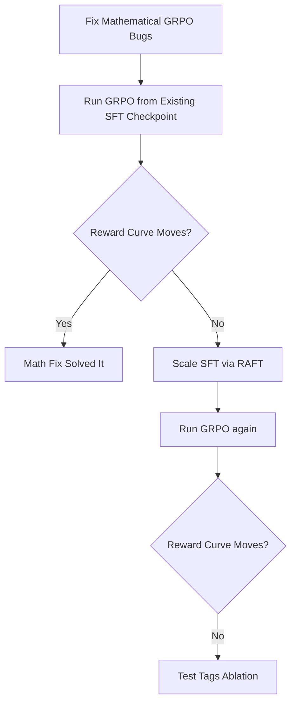

# Qwen Training & Codebase Improvement Report

**Repository:** `rlm-explorer` / `DocTracerRL`
**Date:** September 2026
**Status:** Sections 2A and Step 1-2 of the plan are implemented in the September 10
repair series; commit `3f57a12` is the pre-repair baseline.
**Revision (2026-09-09):** literature claims fact-checked against primary sources; two were
corrected and one removed. See §3 for verdicts and citations.

---

## 1. Executive Summary

This report evaluates the `rlm-explorer` codebase and diagnoses why previous attempts to train Qwen models (both 1.5B and 7B LoRA via GRPO) stalled with flat reward curves. 

The environment itself is fundamentally sound: the iterative exploration agent beats naive RAG and context-stuffing baselines on large multi-hop corpora (0.157 vs 0.050 Answer F1 on MuSiQue). However, the policy training pipeline suffered from **four critical bottlenecks**:
1. **Mathematical flaws in the custom GRPO implementation** (`scripts/train_grpo_custom.py`):
   a systematic bias in the PPO importance ratio (the dominant effect), plus per-turn rather
   than per-token clipping (a secondary variance effect). See §2A for the corrected analysis.
2. **Severely undersized SFT warm-start**: Only 114 trajectories (716 turns), 89% 2-hop (0% 4-hop), collected from Claude Haiku which had high failure rates.
3. **No intermediate reasoning (`<think>`) allowed**: The system prompt prohibits prose, so the
   model jumps straight to Python without planning multi-hop lookups. Plausible contributor;
   the size of the effect is **not established** (see §3).
4. ~~**Sub-optimal base model choice**~~ — **retracted.** Head-to-head benchmarks do not support
   preferring `Qwen2.5-Coder-7B-Instruct` here (see §3).

---

## 2. Codebase Audit & Identified Flaws

### A. Mathematical Bugs in `scripts/train_grpo_custom.py`

#### 1. Logits-Warper Bias in the Importance Ratio (Critical — dominant effect)

`_old_log_prob_from_scores` read the "old" log-prob from `model.generate()`'s returned
`scores`. Those scores are processed by **every** logits warper — temperature, top-k, top-p —
whereas `_step_log_prob_and_kl` recomputed from **raw** logits. The ratio therefore measured
warper distortion, not policy change, and was wrong from the very first update.

The function's own docstring warned about exactly this and the warning was not honoured:
the signature defaulted to `temperature=0.8`, and `top_k`/`top_p` were never disabled, so the
model's `generation_config` defaults applied.

Measured on `gpt2`, importance ratio over 8 sampled tokens (correct value ~1.0):

| condition | ratio |
|---|---|
| T=1.0, no top_k/top_p | **1.0002** |
| T=0.8, no top_k/top_p | **0.539** |
| T=1.0, top_k=50 | **0.037** |
| T=0.8, top_k=50 | **0.025** |

Top-k is roughly 15x the distortion of temperature — fixing only temperature would have left
the bug in place. Over actions of up to `max_new_tokens=256` the bias compounds across the
sequence, pinning the ratio far below `1 - eps`.

**Consequence is asymmetric, not a uniform zeroing.** With `PPO_CLIP_EPS = 0.2`:

- **positive advantage** — `min()` selects the unclipped branch, so gradient flows but is
  scaled by the tiny ratio (heavily attenuated);
- **negative advantage** — `min()` selects the clipped branch, which is constant in theta, so
  gradient is **exactly zero**.

The policy is weakly pulled toward good behaviour and never pushed away from bad behaviour —
which is the flat reward curve that was observed. This asymmetry is asserted directly in
`tests/test_grpo_loss.py::test_per_token_ppo_ratio_and_gradient_asymmetry`.

**Fix (shipped):** drop `output_scores=True` and compute old log-probs from a
clean forward pass (`_compute_token_log_probs`), which is immune to all warpers.

#### 2. Per-Turn Rather Than Per-Token Clipping (secondary)

```python
ratio = torch.exp(lp - old_lp)   # lp, old_lp summed over the whole turn
```

Summing log-probs over an entire turn makes the ratio a product of per-token ratios, which has
high variance for long actions. Standard PPO/GRPO (TRL, verl, DeepSeekMath) clips **per token**:

$$\mathcal{L}_{\text{CLIP}} = -\sum_{t=1}^T \min\left(r_t(\theta) A, \text{clip}(r_t(\theta), 1-\epsilon, 1+\epsilon) A\right)$$

Note this is a *variance* problem, and it only bites once weights have moved (epoch 2+). At
epoch 0 a correctly-implemented sequence ratio is exactly 1.0 regardless of length — which is
why the warper bias in #1, not this, is what broke training from step 0.

**Fix (shipped):** per-token ratios and `min(...).sum()`.

#### 3. Context Truncation Gradient Shift
In `_step_log_prob_and_kl`:
```python
if ctx.shape[0] > MAX_CTX_TOKENS:
    ctx = ctx[-MAX_CTX_TOKENS:]
```
Truncating the prompt from the left during backward modifies RoPE positions and attention
context relative to generation time, creating inconsistent log-probs.

**Partially addressed:** truncation was extracted to `_prepare_ctx()` and is now
applied identically in both the old-log-prob and update passes, so the *ratio* is
self-consistent. The residual issue stands: both passes use the truncated context while
generation used the full one, so the "old policy" is not literally the sampling policy.
**Not yet instrumented** — the fraction of contexts hitting `MAX_CTX_TOKENS` is still unmeasured
and should be logged.

---

### B. Environment & Suite Flaws

1. **Failing Unit Test in `tests/test_corpus.py:21`**
   - Test expects `len(docs) == 28`, but the synthetic corpus was expanded to 43 documents.
   - **Fix (shipped):** Updated the target length assertion.
2. **Quadratic Cumulative Script Execution in `src/env/repl.py`**
   - `PersistentREPL` executes the growing cumulative script from step 1 on every turn. In an RL loop with $B=4, G=8, T=10$, that is up to 320 executions per gradient step.

---

## 3. Literature Review & Research Grounding

**All claims below were fact-checked against primary sources on 2026-09-09.** Verdicts are
stated explicitly. Two claims from the original draft were corrected and one was retracted.

| Topic | Verified finding | Verdict | Application here |
|---|---|---|---|
| **Retrieved token masking** | [Search-R1 (arXiv:2503.09516)](https://arxiv.org/abs/2503.09516), Jin et al. — the policy-gradient loss is computed **only over LLM-generated tokens**; retrieved passage tokens are masked, preventing verbatim copying and stabilising training. Reported +26% (Qwen2.5-7B), +21% (Qwen2.5-3B), +10% (LLaMA3.2-3B) over baselines across 7 QA datasets. | ✅ **Verified** | Mask environment observations; backprop only through assistant-generated tokens. Already noted in `RESULTS.md:141`. |
| **Turn-level credit assignment** | [GTPO (arXiv:2511.14846)](https://arxiv.org/abs/2511.14846) — Group Turn Policy Optimization. Its stated motivation is precisely this project's failure mode: GRPO's "coarse-grained, trajectory-level rewards provide insufficient learning signals for complex multi-turn interactions, leading to training stagnation." Uses turn-level rewards, return-based advantages, self-supervised reward shaping. | ✅ **Verified** — but note the gain is **+3.0%** over GRPO on math and **+3.9%** on commonsense/program synthesis. Modest, not transformative. | Optional later refinement. Not a substitute for fixing the ratio. |
| **SFT warm-start size** | A cold-start sweep over 0 / 2.5k / 5k / 10k trajectories finds even **2.5k substantially improves** over the untuned base. Counter-example: [LiteResearcher](https://huggingface.co/datasets/simplex-ai-inc/LiteResearcher-SFT-Data) uses **68,231** trajectories. | ⚠️ **Corrected** — there is **no single "literature standard."** Observed practice spans ~2.5k to ~68k. | The conclusion holds and strengthens: **114 trajectories is ~22x below the smallest studied initialization.** Scale via RAFT. |
| **Reasoning before acting (`<think>`)** | The nearest located measurement is **6–12%** improvement on multi-hop benchmarks from reasoning guidance — and that concerns reasoning during *data construction*, not `<think>` tags at inference. | ❌ **The original "30–45%" claim is retracted — no source located.** Direction plausible, magnitude unestablished. | Worth trying as an ablation, **not** as a claim. Measure it here rather than citing a number. |
| **Base model choice** | [Head-to-head benchmarks](https://llm-stats.com/models/compare/qwen-2.5-7b-instruct-vs-qwen-2.5-coder-7b-instruct): **Qwen2.5-7B-Instruct wins 5** (GSM8k, LiveCodeBench, MATH, MMLU-Pro, MMLU-Redux); **Coder wins 2** (HumanEval, MBPP). Coder *loses* LiveCodeBench. | ❌ **Retracted.** No source found supporting superior "REPL state tracking" or "tool execution." | **Do not swap.** Coder is better at isolated function synthesis; the general model is better at reasoning-heavy code — and this agent must reason across multi-hop retrieval *and* write code. |

### Close prior art worth citing

**[Tool-R1 (arXiv:2509.12867)](https://arxiv.org/abs/2509.12867)** — Zhang et al., Harbin
Institute of Technology + Huawei Noah's Ark Lab. RL for agentic tool use where the model
**generates executable Python**, with **variable sharing across steps** and an outcome reward
combining answer judgment with **code execution success**. ~10% gain on GAIA. This is
architecturally very close to DocTracerRL and should be cited and positioned against in any
write-up.

## 4. Implementation Plan (Revised Methodology)

The original plan confounded 4 variables (model swap + prompt swap + scale SFT + loss fix). To prevent experimental contamination, the variables must be isolated.



### Step 1: Fix Mathematical Bug & Test Suite (Completed)
- `tests/test_corpus.py` fixed to assert `len(docs) == 43`.
- `scripts/train_grpo_custom.py` updated to compute per-token `old_token_lp` using a clean forward pass (bypassing generation logits warpers).
- Implemented per-token PPO clipping logic.
- `tests/test_grpo_loss.py` implemented to assert asymmetric PPO gradient behavior.

### Step 2: Rerun GRPO from Existing SFT Checkpoint (Current Next Step)
1. Run `./scripts/train_grpo_custom.py` directly from the `checkpoints/sft_qwen_7b/final` checkpoint to isolate the effect of the loss formulation bug fix. This serves as the mechanical baseline.

### Step 3: Scale SFT (If necessary)
If Step 2 still produces a flat reward curve, scale up SFT to overcome cold-start collapse:
1. Run rollouts on 1,000+ MuSiQue train questions using Claude 3.5 Sonnet.
2. Filter for episodes with reward $\ge 0.7$ and expand to >2,000 trajectories.

### Step 4: Add Intermediate Reasoning (If necessary)
If the model stalls despite scaled SFT, allow explicit `<think>` planning to break the multi-hop reasoning ceiling.
